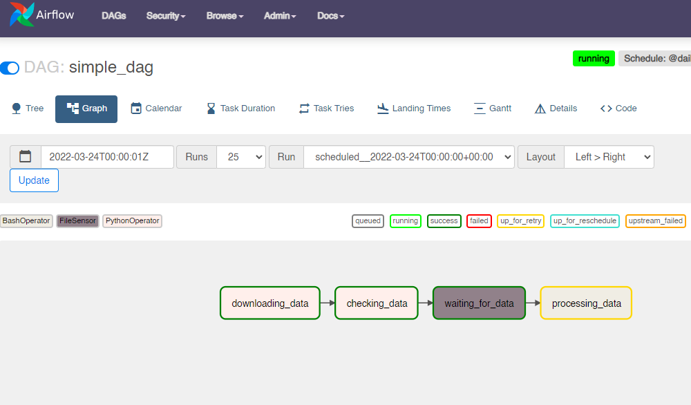
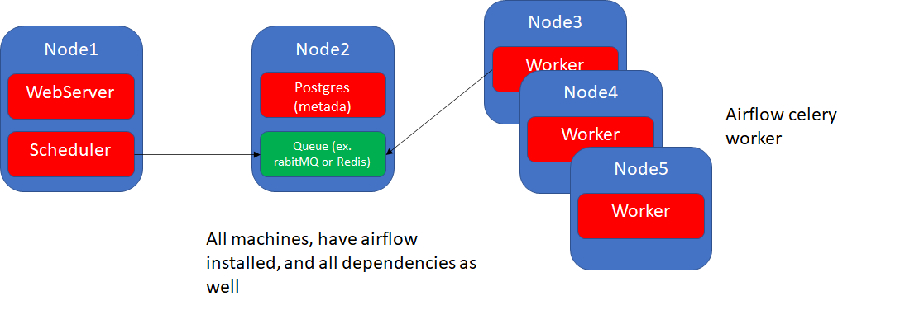

---


typora-copy-images-to: img
---


# Components

## WebServer

Flask gunicorn

## Scheduler

## Metadata Database

sql alchemy
- postgres, mysql, oracle, *mongodb

*limited

## Executor

Kubernetes
Celery
Local executors

## Worker

Where the task is executed


# Architectures

## single node


`astrocloud dev init`

cria o ambiente!

`astrocloud dev start`

inicia o ambiente

`astrocloud dev stop`

para de rodar


# Dag
Directed Aciclic graph


Task= instance of operator

Task Instance -> foi agendada!

Task scheduled -> instance object -> specific run of a task.

## Operator


Task in a pipeline

### Action operator

Ex:

Executar algo como uma função python (operator)

Executar algo como uma função bash (operator)

Executar algo como uma função sql (operator)


### Transfer operator

transfer data from a source to a destination

mysql -> prestodB

### Sensor operator

**wait** for a file to land in a folder


## Dependencies


USE bit shift operators

## Workflow


# Task Lifecycle


1 - Webserver 30 seg / Scheduler 5 min parses the file

2 - Schedule creates a  DagRun (instance of Dag) -> (Task Instance -> scheduled)

3 - Queued


3 - Send to the executor (running in a worker)

4 - Task success if ok


# Extras and Providers


extras instala dependencias para uma feature nova


provider é um gancho para isso


# Interacting with apache airflow


## Comandos CLI

```docker ps```


# Create Dags


```python
from airflow import DAG

with DAG(dag_id='simple_dag') as dag:
    None


```


## DAGs Start and Scheduling

- start date: defines date start to be scheduled (date: 01/01/2022 10h00)
- schedule_interval: frequency (ex. 10 min)
  - 01/01/2020 10h10min starts the first task!

- end_date: ex. 2 months (end of the cycle)


- datetime = UTC


DAG(id, datetime)

task= DummyOperator(id) é uma classe!!!

```python
from airflow import DAG
from airflow.operators.dummy import DummyOperator

with DAG(dag_id='simple_dag',start_date=datetime(2022,3,23)) as dag:
    task_1=DummyOperator(
      task_id='task_1'
   )


```


## tips:

não usar datetime.now() ou algo dinamico

o datetime é UTC

se setar tempo passado airflow vai executar todas as dags

## scheduling

CRON- expression

https://crontab.guru/

simple expressions  @daily @weekly

timedelta(hours=1)

none (external trigger)


## backfilling

There can be the case when you may want to run the DAG for a specified historical period e.g., A data filling DAG is created with `start_date` **2019-11-21**, but another user requires the output data from a month ago i.e., **2019-10-21**. This process is known as Backfill.

You may want to backfill the data even in the cases when catchup is disabled. This can be done through CLI. Run the below command

```python
from airflow import DAG
from airflow.operators.dummy import DummyOperator
from datetime import datetime, timedelta

with DAG(dag_id='simple_dag',schedule_interval="*/10 * * * *",
         start_date=datetime(2022,3,23),catchup=True) as dag:
    task_1=DummyOperator(
      task_id='task_1'
   )


```

## operators

separate tasks to avoid fail

idempotency - same input -> same output

retry=

retry_delay

criar default args


```python
from airflow import DAG
from airflow.operators.dummy import DummyOperator
from datetime import datetime, timedelta

with DAG(dag_id='simple_dag',schedule_interval="*/10 * * * *",
         start_date=datetime(2022,3,23),catchup=True) as dag:
    task_1=DummyOperator(
      task_id='task_1',
      retries=5,
      retry_delay=timedelta(minutes=5)
   )
    
    task_2=DummyOperator(
      task_id='task_2',
      retries=5,
      retry_delay=timedelta(minutes=5)
   )
    
    task_3=DummyOperator(
      task_id='task_3',
      retries=5,
      retry_delay=timedelta(minutes=5)
   )


```

podemos criar argumentos padrão para todas as tasks na forma de dicionarios


```python
from airflow import DAG
from airflow.operators.dummy import DummyOperator
from airflow.utils.dates import days_ago
from datetime import datetime, timedelta


default_args_dict={
    'retries': 5,
    'retry_delay': timedelta(minutes=5)
}

with DAG(dag_id='simple_dag',default_args=default_args_dict,schedule_interval="*/10 * * * *",
         start_date=days_ago(3),catchup=True) as dag:
    task_1=DummyOperator(
      task_id='task_1'
   )
    
    task_2=DummyOperator(
      task_id='task_2'
   )
    
    task_3=DummyOperator(
      task_id='task_3',      
      retries=3      
   )


```


## Python operator


POdemos criar funções proprias com o PythonOperator, passar parâmetros com kwargs (internos) ou parâmetros próprios

  


```python
from airflow import DAG
from airflow.operators.python import PythonOperator
from airflow.utils.dates import days_ago
from datetime import datetime, timedelta

default_args_dict={
  'retries': 5,
  'retry_delay': timedelta(minutes=5)
}

def _downloading_data(my_param,**kwargs):
 print(my_param,kwargs)

with DAG(dag_id='simple_dag',default_args=default_args_dict,schedule_interval="@daily",
   start_date=days_ago(3),catchup=True) as dag:
  downloading_data=PythonOperator(
   task_id='downloading_data',
   python_callable=_downloading_data,
   op_kwargs={'my_param':775}
  )


```

## Sensor


Esperar algo acontecer, então precisa-se colocar um sensor e criar uma conexão

Exemplo :

```python
from airflow import DAG

from airflow.operators.python import PythonOperator
from airflow.sensors.filesystem import FileSensor
from airflow.utils.dates import days_ago
from datetime import datetime, timedelta


default_args_dict={
    'retries': 5,
    'retry_delay': timedelta(minutes=5)
}

def _downloading_data(**kwargs):
  with open('/tmp/myfile.txt','w') as f:
    f.write('my_data')

with DAG(dag_id='simple_dag',default_args=default_args_dict,schedule_interval="@daily",
         start_date=days_ago(3),catchup=True) as dag:
  
    downloading_data=PythonOperator(
      task_id='downloading_data',
      python_callable=_downloading_data      
   )
   
   #default é monitorar a cada 30s
    waiting_for_data=FileSensor(
      task_id='waiting_for_data',
      fs_conn_id='fs_default',
      filepath='myfile.txt'
      
     
   ) 

```

## Define DAG path/dependencies

We can use several ways to define paths


- set_downstream/upstream

```python
downloading_data.set_downstream(waiting_for_data)#next
waiting_for_data.set_downstream(processing_data)#next

waiting_for_data.set_upstream(downloading_data) #previous
processing_data.set_upstream(waiting_for_data) #previous

```

- bitshift >> or << 

```python
downloading_data >> waiting_for_data >> processing_data

```

- Helper functions 

  useful for cross dependencies

```python

from airflow.models.baseoperator import chain,cross_downstream

chain(downloading_data,waiting_for_data,processing_data)

cross_downstream([downloading_data,checking_data],[waiting_for_data,processing_data])


```

## Exchanging Data

To pass values between tasks we can use XComs (Cross communication)

- push xcom and pull com

You can see the XCom at the Admin panel

```python
ti.xcom_push()
ti.xcom_pull(key,task_id)
#example of return has a default push to key 'return_value' 
return 42
#use the ti to get the context
def _checking_data(ti):
	my_xcom=ti.xcom_pull(key='return_value',task_ids=['downloading_data'])


```

Limitation!

- SQLite: 2 Go

  Postgres: 1 Go

  MySQL: 64 KB


## Error Handling

When an error in a task occurs, it will stay 'up_for_retry'



in the processing data, logs, we can see the error was:

```
airflow.exceptions.AirflowException: Bash command failed. The command returned a non-zero exit code 1.
```


# Executors


- Sequential Executor: 

  only debug, uses sqlite (so limited in writes and reads)

- Parallel Executor

  - Parallelism=32 limits everything (if is 4, the other parameters will be 4)
  - dag_concurrency=16
  - max_active_runs_per_dag=16
  - max_active_runs=6
  - concurrency=1 (only 1 task will run at a time -> specific DAG)

Example:

## Scaling Airflow

- LocalExecutor: limited to yout machine

- CeleryExecutor: Celery Cluster (distributed task queue on multiple machines)

  

  


```python
from airflow import DAG

with DAG(dag_id='simple_dag') as dag:
    None


```

