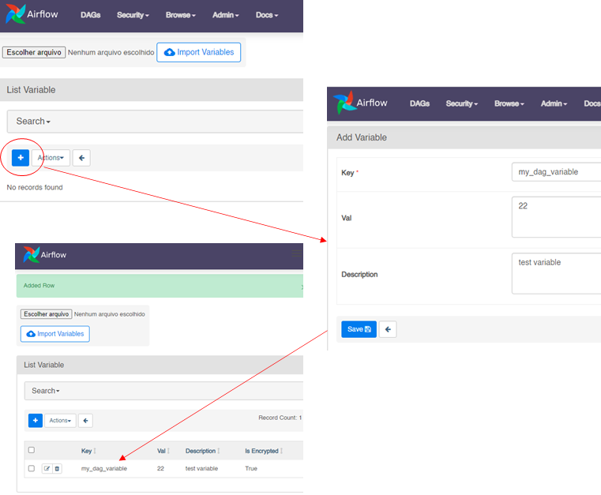
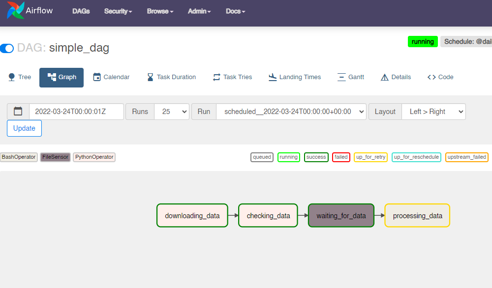
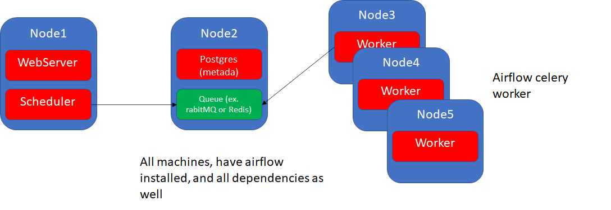

---


typora-copy-images-to: img
---


## DAGs Basics

- scheduler will read the files from the dag folder if they contain the words ``dag`` or `` airflow``

  - change this with core.DAG_DISCOVERY_SAFE_MODE=False - will try to parse all (DONT RECOMMEND)

- can add `.airflowignore` to define files to be skipped in the folder dags

```python
from airflow import DAG
from airflow.operators.dummy import DummyOperator
from datetime import datetime, timedelta

with DAG(dag_id='simple_dag',description="dag in charge of processing custom data",start_date=datetime(2022,3,23),schedule_interval="@daily",dagrun_timeout=timedelta(minutes=10),tags="data science") as dag:
    task_1=DummyOperator(
      task_id='task_1'      
   )
    
#the other way (hard to maintainance)
mydag= DAG(...)
DummyOperator(dag=mydag)
```


**Important Tips/Best practices:**

- dag_id must be UNIQUE / there is no error ... but it will be ambigous

- description, important when there are many DAGs

- Task (Operators expects a start_date) so it is better to define at the DAG 

  - Operators can also have start_date, however it is no good practice as multiple tasks cannot start at the same time

- specify a dagrun_timeout so that you know that an error occurred it the task is taking too long

- Tags to organize the dags

- datetime is UTC

- catchup=False to avoid the automatic backfilling

  NOT TO DO

- Do not use datetime.now() ou any dynamic concept

- if setup past time airflow will execute all DAGs

## DAG Scheduling

**Important Parameters**

- start date: defines date start to be scheduled (date: 01/01/2022 10h00)
- schedule_interval: frequency (ex. 10 min)
  - 01/01/2020 10h10min starts the first task!
- end_date: ex. 2 months (end of the cycle)


IMPORTANT

execution_date marks the real start_date

```python
from airflow import DAG
from airflow.operators.dummy import DummyOperator
from datetime import datetime, timedelta

with DAG(dag_id='simple_dag',schedule_interval="*/10 * * * *",
         start_date=datetime(2022,3,23),catchup=True) as dag:
    task_1=DummyOperator(
      task_id='task_1'
   )


```

## 

**Schedule interval can be **

- CRON- expression (https://crontab.guru/) - stateless

  simple expressions  @daily @weekly

- Direct timedelta:  timedelta(hours=1) - statefull

  - CRON is relative to the a date ("* * */3 * *"  (start of the month, every 3 days) is different than  timedelta(days=3) after 3 days.

  - Another difference is the dependecy of the start_date

    - timedelta uses start_date as a reference
    - CRON just need to know when to start

    

- None (external trigger)


## Idempotent / deterministic


NOT IDEMPOTENT: SQL example

```sql
    task_1=PostgresOperator(
      task_id='create_table',
      sql="CREATE TABLE my_table ...")
    
    BashOperator(task_id="create folders",bash_command="mkdir my_folder")
```

This task will show an error at the second try as the table or the folder were already created.

Correction: 

```sql
    task_1=PostgresOperator(
      task_id='create_table',
      sql="CREATE TABLE IF NOT EXISTS my_table ...")
```

This task will show an error at t


## Backfilling / Catch-up

- Mistake in the Dags ... rerun ..

There can be the case when you may want to run the DAG for a specified historical period e.g., A data filling DAG is created with `start_date` **2019-11-21**, but another user requires the output data from a month ago i.e., **2019-10-21**. This process is known as Backfill.

- **Catch-up=TRUE** : runs all the non triggered runs (maybe thousands and that may be a problem)

- **Catch-up=FALSE** : only runs the latest non triggered dag run 
  - **max_active_runs=2**: limit the numbers running at the same time
  
  - BEST PRACTICE: always set to FALSE and run via CLI command the backfilling or via interface (select start and end and turn CLEAR)
  
    
  
  ```bash
  
  airflow dags backfill -s 2020-01-01 -e 2021-01-01 
  ```
  
  Comparison using 

## Variables

Object (KEY, VALUE)




**TIPS**

- use the dag name as part of the variable name

- add 'secret' to the variable name to encrypt it

  - other keywords are: password / key 

  


```python
from airflow.models import Variable

def _function():
    var=Variable.get("my_dag_variable")     
    print(var)


```

Comparison u

## Operators

**TIPS**

- separate tasks in different operators to avoid fail (ONE OPERATOR -> ONE TASK)

- **idempotency** - same input -> same output

- task_id unique!

- **Default args** as good practice to common parameters. I.e. retry/retry_delay.

  See all attributes [here at the baseoperator class](https://airflow.apache.org/docs/apache-airflow/stable/_api/airflow/models/baseoperator/index.html)

  

```python
from airflow import DAG
from airflow.operators.dummy import DummyOperator
from datetime import datetime, timedelta

with DAG(dag_id='simple_dag',schedule_interval="*/10 * * * *",
         start_date=datetime(2022,3,23),catchup=True) as dag:
    task_1=DummyOperator(
      task_id='task_1',
      retries=5,
      retry_delay=timedelta(minutes=5)
   )
    
    task_2=DummyOperator(
      task_id='task_2',
      retries=5,
      retry_delay=timedelta(minutes=5)
   )
    
    task_3=DummyOperator(
      task_id='task_3',
      retries=5,
      retry_delay=timedelta(minutes=5)
   )


```

Comparison using the default args for every task

```python
from airflow import DAG
from airflow.operators.dummy import DummyOperator
from airflow.utils.dates import days_ago
from datetime import datetime, timedelta


default_args_dict={
    'retries': 5,
    'retry_delay': timedelta(minutes=5)
}

with DAG(dag_id='simple_dag',default_args=default_args_dict,schedule_interval="*/10 * * * *",
         start_date=days_ago(3),catchup=True) as dag:
    task_1=DummyOperator(
      task_id='task_1'
   )
    
    task_2=DummyOperator(
      task_id='task_2'
   )
    
    task_3=DummyOperator(
      task_id='task_3',      
      retries=3      
   )


```


### Python Operator

- Create python funtions using the PythonOperator
- Using parameters arguments using ``kwargs`` (context of the dag run dictionary )
- Create parameters with ``op_kwargs`` and create a dictionary like the ``{my_param:775}``  example

```python
from airflow import DAG
from airflow.operators.python import PythonOperator
from airflow.utils.dates import days_ago
from datetime import datetime, timedelta

default_args_dict={
  'retries': 5,
  'retry_delay': timedelta(minutes=5)
}

def _downloading_data(my_param,**kwargs):
 print(my_param,kwargs)

with DAG(dag_id='simple_dag',default_args=default_args_dict,schedule_interval="@daily",
   start_date=days_ago(3),catchup=True) as dag:
  downloading_data=PythonOperator(
   task_id='downloading_data',
   python_callable=_downloading_data,
   op_kwargs={'my_param':775}
  )


```

### BashOperator

- Test fail cases!

## Sensor


### FileSensor example

1. Function to create a file: _downloading_data

2. Sensor that is triggered as the file is created: waiting_for_data

   needs a connection ID, created at the user interface

3. Add a **Connection**

   - add a Conn id

   - Conn type: File (if does not exist, install the proper Provider)

   - Description (good practice)

   - Extra: json the folder where file should exist, i.e.  ``{'path:' /tmp/}``, it is encrypted

   - filepath: name of the file

   - poke_interval: check the time interval to recheck the folder

     behaviour: as soon as file arrives (check every 30s by default) at tmp folder execute next task

```python
from airflow import DAG

from airflow.operators.python import PythonOperator
from airflow.sensors.filesystem import FileSensor
from airflow.utils.dates import days_ago
from datetime import datetime, timedelta


default_args_dict={
    'retries': 5,
    'retry_delay': timedelta(minutes=5)
}

def _downloading_data(**kwargs):
  with open('/tmp/myfile.txt','w') as f:
    f.write('my_data')

with DAG(dag_id='simple_dag',default_args=default_args_dict,schedule_interval="@daily",
         start_date=days_ago(3),catchup=True) as dag:
  
    downloading_data=PythonOperator(
      task_id='downloading_data',
      python_callable=_downloading_data      
   )
   
   #default é monitorar a cada 30s
    waiting_for_data=FileSensor(
      task_id='waiting_for_data',
      fs_conn_id='fs_default',
      filepath='myfile.txt'
         
   ) 
```


## DAG path/dependencies

We can use several ways to define paths

- set_downstream/upstream

```python
downloading_data.set_downstream(waiting_for_data)#next
waiting_for_data.set_downstream(processing_data)#next

waiting_for_data.set_upstream(downloading_data) #previous
processing_data.set_upstream(waiting_for_data) #previous
```

- bitshift >> or << 

```python
downloading_data >> waiting_for_data >> processing_data
```

- Helper functions 

  useful for cross dependencies

```python
from airflow.models.baseoperator import chain,cross_downstream

chain(downloading_data,waiting_for_data,processing_data)
cross_downstream([downloading_data,checking_data],[waiting_for_data,processing_data])
```


## Exchanging Data between tasks - XCOMS

To pass values between tasks we can use XComs (Cross communication)

- xcom_push / xcom_pull  combined with **ti** as parameter
- at the usar interface Admin->XCOMS we can see the variables
- json format

Example using default retun_value

```python
def _downloading_data(**kwarfs):
	...
#example of return has a default push to key 'return_value' 
return 42
#use the ti to get the context
def _checking_data(ti):
	my_xcom=ti.xcom_pull(key='return_value',task_ids=['downloading_data'])
```

Example with defined key value parameter

```python
def _downloading_data(**kwarfs):
	...
    ti.xcom_push(key='my_key',value=775)
#example of return has a default push to key 'return_value' 

#use the ti to get the context
def _checking_data(ti):
	my_xcom=ti.xcom_pull(key='my_key',task_ids=['downloading_data'])
```

Limitation!

- SQLite: 2 Gb

  Postgres: 1 Gb

  MySQL: 64 Kb


## Error Handling

- - 
- at the DAG level
  - on_success_callback(context)
  - on_failure_callback
    - here you can send a notification
    - if you have a failure in your callback, the callback will not be retried
- at the Task level
  - on_success_callback
  - on_failure_callback
  - on_retry_callback
    - can you do something between each retries
  - if it failed due to an timeout or an error
    - context['exception'] will be an instance of some exception (import airflow.exceptions)
      - AirflowTaskTimeout
      - AirflowSensorTimeout
      - ...
  - context['ti'].try_number() - will give you the retry number

Browse -> Task Instance

- Filter by state
- Select and clear (rerun DAGs)

When an error in a task occurs, it will stay 'up_for_retry'



in the processing data, logs, we can see the error was:

```
airflow.exceptions.AirflowException: Bash command failed. The command returned a non-zero exit code 1.
```


## Executors

- Default Executor is the SequentialExecutor

- Sequential Executor: 

  only debug, uses sqlite (so limited in writes and reads)

  ```
  docker ps
  docker exec -it <conteiner_id_scheduler>
  
  in airflow
  
  grep executor airflow.cfg
  
  grep executor sql_alchemy_conn
  
  ```

  

- Parallel Executor parameters

  - Parallelism=32 limits everything (if is 4, the other parameters will be 4) - maximum number of tasks in parallel in the entire airflow instance
  - dag_concurrency=16 (across all the DAG_runs)
  - max_active_runs_per_dag=16
  - max_active_runs=6
  - concurrency=1 (only 1 task will run at a time -> specific DAG)

Example:

parallelism = 4

dag_concurrency=16 

practice -> only 4 will be executed

## Scaling Airflow

- LocalExecutor: limited to yout machine

- CeleryExecutor: Celery Cluster (distributed task queue on multiple machines)

  

  


```python
from airflow import DAG

with DAG(dag_id='simple_dag') as dag:
    None


```

