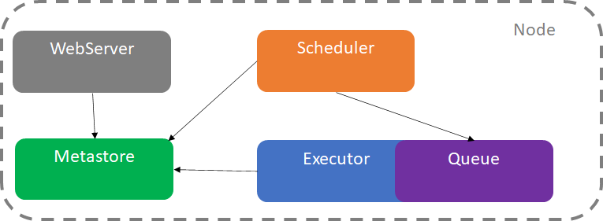
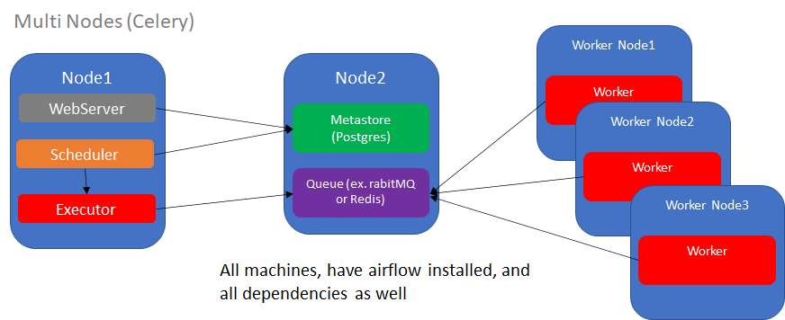
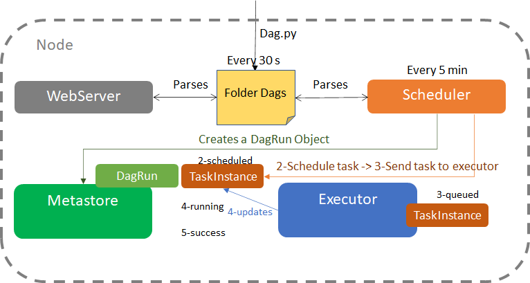
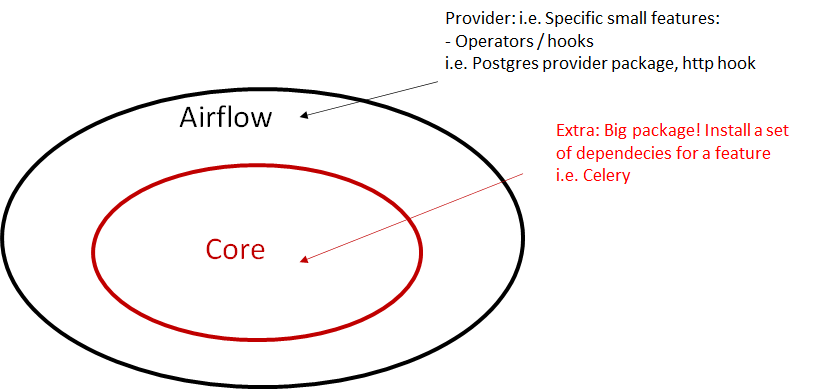

---

typora-copy-images-to: img
---

# Airflow

- Open Source platform to programmatically author, schedule and monitor workflows
- Create, monitor and manage data Pipelines
  - Dynamic 
  - Scalable - Celery/Kubernetes
  - Interactive
    - User Interface
    - CLI
    - REST API
  - Extensible
- NOT a STREAMING or DATA PROCESSING framework

# Core Components

​		Main Components

- Web Server: flask server with unicorn

- Scheduler: Heart, schedule and trigger tasks

- Metadata Database: Connections 

  - sql alchemy compatible: postgres, mysql, oracle, *mongodb *limited

  

  Behind the scenes:

- Executor: **How** tasks will be executed

  - Kubernetes cluster
  - Celery cluster with multiple machines
  - Local executor: Powerfull machine
  - Sequential
  - Parallel

- Worker: **Where** the task is executed (process/subprocess)

  - i.e. Kubernetes->Process inside a POD

# Architectures

How do they work together?

- Single Node: Components run on the same machine

  1. Web server interacts with metastore: states of tasks, users, permissions all you can see in the webserver

  2. Scheduler changes the states in the metastore and creates a task and sends for the executor (queue of the executor)

  3. Task is ready to be fetched by a worker

  4. Executor interacts with metastore to update status at the interface

     

- Multi Node: Celery

1. Separated nodes

2. Queue in another node, external to the executor, like rabitMQ or Redis

3. Executor sends the taks to the Queue, which sends tasks to the workers

   

# Core Concepts

- **DAGs**: Directed Acyclic graph
  - There is no loop

- **Operators**: Task in the DAG

  - Action Operators

    I.E.

    Execute python funtions PythonOperator

    Execute bash functions BashOperator

    Execute SQL SQLOperator

    [(list of operators)](https://airflow.apache.org/docs/apache-airflow/stable/_api/airflow/operators/index.html)

  - Transfer Operator

    transfer data from a source to a destination

    mysql -> prestodB

  - Sensor Operator

    **wait** for a file to land in a folder

- **Tasks**:  Instance of an Operator

- **Task Instance**: Represents a specific run of a task: DAG + TASK + point in time

- **Dependencies**: operator A >> operator B >> operator C

  - `set_upstream` or `set_downstream`
  - << OR >>
  - helper functions: i.e. `chain` , `cross_downstream`

- **Workflow**: DAG ( Operador1(Task) >> Operator2(Task)  )

  

  

  # Task Lifecycle

  1. Folder dags sees every 30s a new python file / Scheduler every 5 min
  2. Scheduler creates dagRun
  3. Scheduler schedule a task (task status=scheduled)
  4. Scheduler send task do executor (task status=queued)
  5. Executor executes the task (task status = running)
  6. If ok (task status= success)

  

# Extras and Providers

- **Extras (BIG package) **: extend core functionalities (big package that may also contain providers). Extras are standard Python setuptools feature that allows to add additional set of dependencies as optional features to “core” Apache Airflow. One of the type of such optional features are providers packages, but not all optional features of Apache Airflow have corresponding providers. There are extras that do not install providers.
  - Entirely functionality 
  - i.e. Celery (Core Apache is extended)
- **Provider (Small package)**: entirely separated specific modules
  - Operators/hooks
  - i.e. Postgres / Http

Just to prevent confusion of extras versus provider packages: Extras and providers are different things, though many extras are leading to installing providers.

